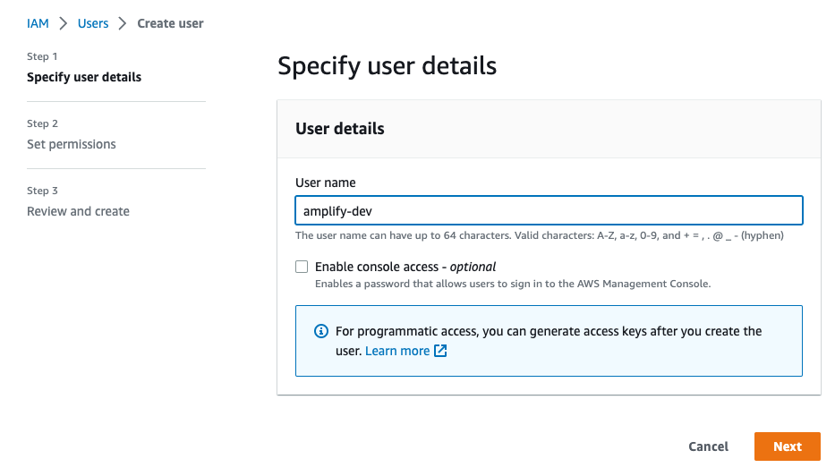

# online-shop-vite
React using Vite

For Vite get started documentation please visit https://vitejs.dev/guide/

## Setting up React-Typescript + Vite for Amplify:

1. Install Vite
```bash
# npm 6.x
npm create vite@latest my-react-app --template react-ts

# npm 7+, extra double-dash is needed:
npm create vite@latest my-react-app -- --template react-ts

# yarn
yarn create vite my-react-app --template react-ts

# pnpm
pnpm create vite my-react-app --template react-ts
```

2. cd to your project root folder and install the dependencies by running `npm install` (if you are using npm) and start your app by running `npm run dev`
```bash
npm install
npm run dev
```

3. Modify the `index.html` by adding the following script before the closing body tag `</body>`
```html
<script>
    window.global = window;
    window.process = {
      env: { DEBUG: undefined },
    }
    var exports = {};
</script>
```

4. Update the `vite.config.ts` and add a resolve alias inside the `defineConfig({})` as seen below.
```javascript
export default defineConfig({
  plugins: [react()],
  resolve: {
      alias: [
      {
        find: './runtimeConfig',
        replacement: './runtimeConfig.browser',
      },
    ]
  }
})

```

5. Update the `tsconfig.json` file and add `skipLibCheck: true` under `compilerOptions`.
```bash
    "compilerOptions": {
        "skipLibCheck": true,
    }
...
```

## Setting up Amplify:

For more information on how to set up your app to Amplify please visit https://docs.amplify.aws/start/q/integration/react/

1. Install `Amplify CLI`. You only need to do this once. Skip this part if you already installed Amplify CLI in your computer. 
```bash
npm install -g @aws-amplify/cli
```
2. Configure your amplify settings by typing
```bash
amplify configure
```
`amplify configure` will ask you to sign into the AWS Console.

3. Once you're signed in, Amplify CLI will ask you to create an IAM user.
```bash
Specify the AWS Region
? region:  # Your preferred region
Follow the instructions at
https://docs.amplify.aws/cli/start/install/#configure-the-amplify-cli

to complete the user creation in the AWS console
https://console.aws.amazon.com/iamv2/home#/users/create
```
Navigate to the IAM User (https://us-east-1.console.aws.amazon.com/iamv2/home?region=us-east-1#/users/create) creation page if it's not already open.

Enter a User name and select Next. You can name the user anything but we'll call it "amplify-dev".
